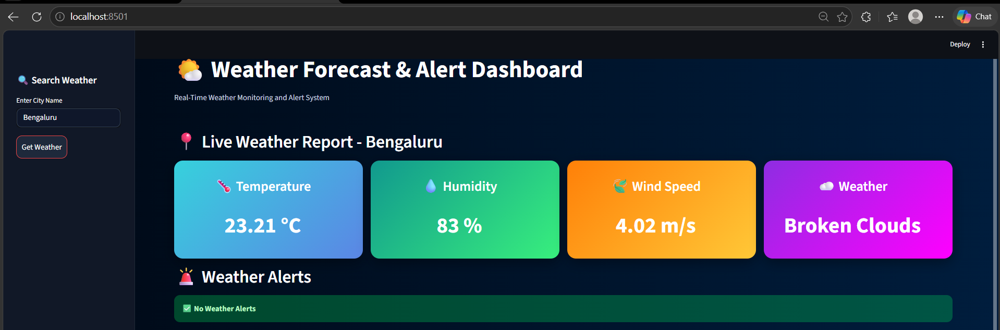
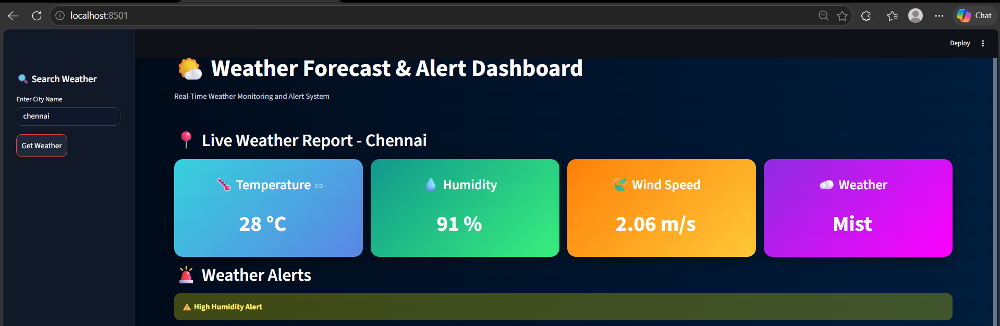
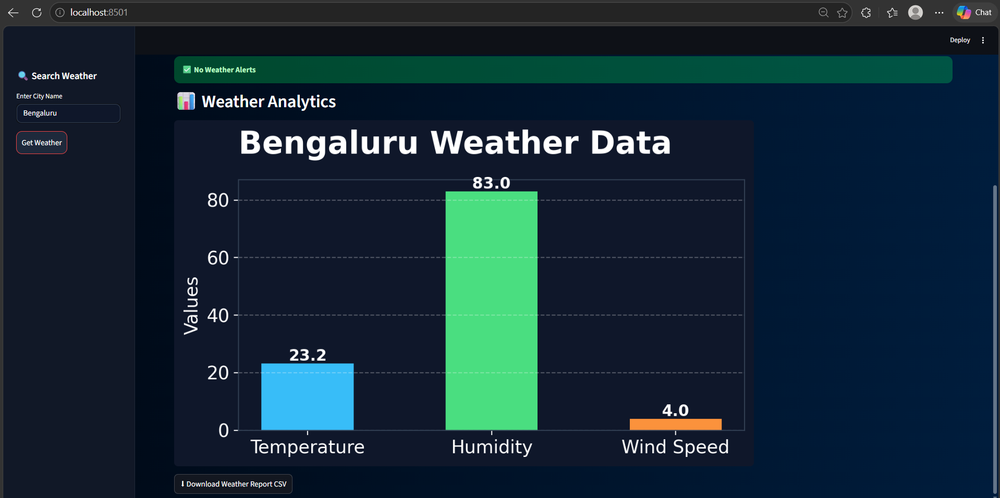
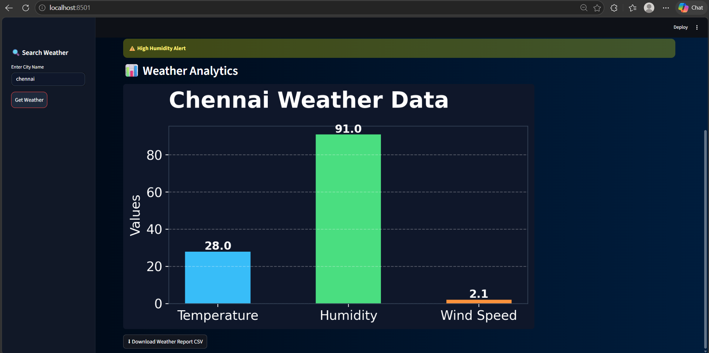
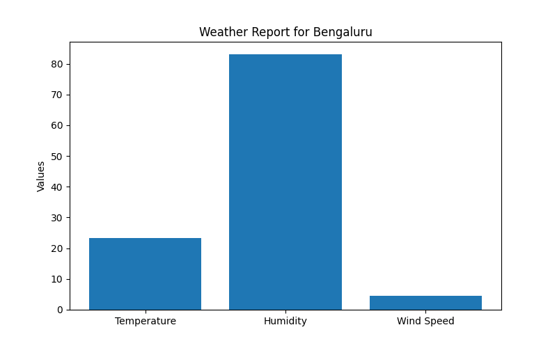
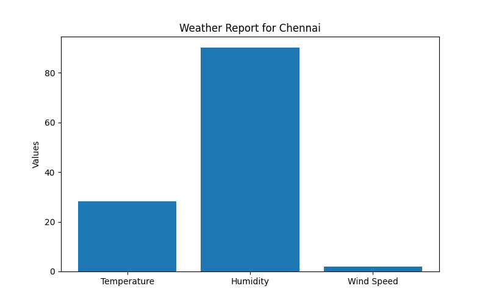
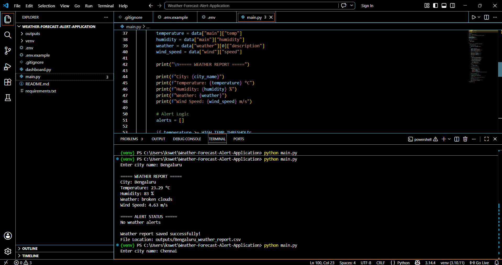

# 🌦️ Weather Forecast & Alert Application

A modern real-time weather monitoring dashboard built using Python and Streamlit.  
This application fetches live weather data using the OpenWeatherMap API and displays interactive weather analytics with alert monitoring and CSV report generation.

---

# 🚀 Features

✅ Real-Time Weather Monitoring  
✅ Weather Alerts System  
✅ Interactive Weather Dashboard  
✅ Beautiful Premium UI Design  
✅ Data Visualization with Matplotlib  
✅ CSV Weather Report Download  
✅ API Integration using OpenWeatherMap  
✅ Responsive Sidebar Navigation  
✅ Dark Theme Professional Interface  

---

# 🛠️ Technologies Used

- Python
- Streamlit
- Requests
- Pandas
- Matplotlib
- OpenWeatherMap API
- dotenv

---

# 📂 Project Structure

```bash
Weather-Forecast-Alert-Application/
│
├── images/
│   ├── Bengaluru_weather_chart.png
│   ├── Chennai_weather_chart.png
│   ├── dashboard_bengaluru.png
│   ├── dashboard_chennai.png
│   ├── Bengaluru_weather_data.png
│   ├── Chennai_weather_data.png
│   └── output_window.png
│
├── outputs/
│   ├── Bengaluru_weather_report.csv
│   └── Chennai_weather_report.csv
│
├── venv/
│
├── .env
├── .env.example
├── .gitignore
├── dashboard.py
├── main.py
├── README.md
└── requirements.txt
```

---

# ⚙️ Installation & Setup

## 1️⃣ Clone the Repository

```bash
git clone https://github.com/your-username/Weather-Forecast-Alert-Application.git
```

---

## 2️⃣ Navigate to Project Folder

```bash
cd Weather-Forecast-Alert-Application
```

---

## 3️⃣ Create Virtual Environment

```bash
python -m venv venv
```

---

## 4️⃣ Activate Virtual Environment

### Windows

```bash
venv\Scripts\activate
```

### Mac/Linux

```bash
source venv/bin/activate
```

---

## 5️⃣ Install Dependencies

```bash
pip install -r requirements.txt
```

---

# 🔑 API Configuration

Create a `.env` file inside the project folder and add your OpenWeatherMap API Key.

```env
API_KEY=your_api_key_here
```

Get API Key from:  
https://openweathermap.org/api

---

# ▶️ Run Terminal Version

```bash
python main.py
```

---

# ▶️ Run Streamlit Dashboard

```bash
streamlit run dashboard.py
```

---

# 📊 Dashboard Preview

## 🌆 Bengaluru Dashboard



---

## 🌧️ Chennai Dashboard



---

# 📈 Weather Analytics

## Bengaluru Weather Data



---

## Chennai Weather Data



---

# 📉 Weather Charts

## Bengaluru Weather Chart



---

## Chennai Weather Chart



---

# 💻 Terminal Output



---

# 📄 CSV Report Generation

The application automatically generates downloadable CSV reports containing:

- Temperature
- Humidity
- Wind Speed
- Weather Description
- Alerts

Reports are stored inside the `outputs/` folder.

---

# 🔔 Weather Alert Conditions

| Condition | Alert |
|----------|----------|
| Temperature > 35°C | High Temperature Alert |
| Humidity > 85% | High Humidity Alert |
| Wind Speed > 10 m/s | Strong Wind Alert |

---

# 📦 Requirements

```txt
streamlit
requests
python-dotenv
pandas
matplotlib
```

---

# 🌟 Future Enhancements

- 7-Day Forecast
- Weather Prediction using Machine Learning
- Email Alert Notifications
- Database Integration
- Deployment on Streamlit Cloud
- Mobile Responsive UI

---

# 👩‍💻 Author

Swetha K

---


# 🔗 OpenWeatherMap API

https://openweathermap.org/api
